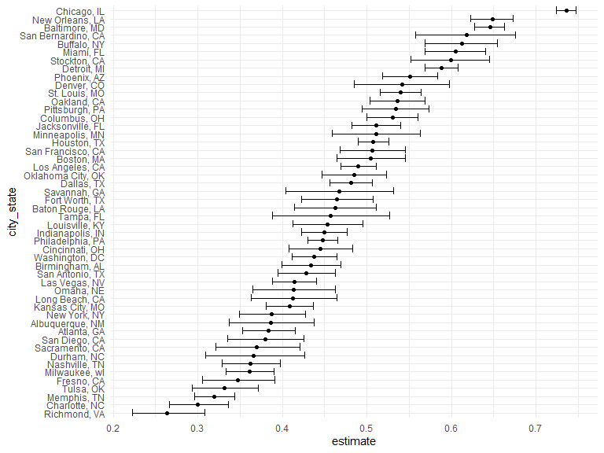
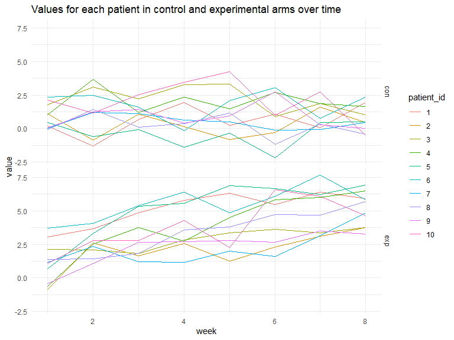

p8105 hw5
================
Sitian Zhou
2023-11-05

``` r
library(tidyverse)

knitr::opts_chunk$set(
    warning = FALSE,
    message = FALSE,
    fig.width = 8, 
    fig.height = 6)

theme_set(theme_minimal())
```

## Problem 1

``` r
homicide <-
  read_csv("data/homicide-data.csv", na = c("", "NA", "Unknown")) |> 
  mutate(
    city_state = str_c(city, ", ", state),
    resolved = as.numeric(disposition == "Closed by arrest")
  ) |> 
  filter(city_state != "Tulsa, AL") 
```

The dataset `homicide` contains information about homicide cases in
United States from 2007 to 2017. It contains 52178 rows and 14 variable,
where each row is a criminal homicide case. The dataset includes the
time the case was reported, the information about victims, the location
of killing, and whether an arrest was made.

The following codes create tables that summarize the total number of
homicides and the number of unsolved homicides across cities.

``` r
# total number of homicides
homicide |> 
  count(city_state) |> 
  knitr::kable()
```

| city_state         |    n |
|:-------------------|-----:|
| Albuquerque, NM    |  378 |
| Atlanta, GA        |  973 |
| Baltimore, MD      | 2827 |
| Baton Rouge, LA    |  424 |
| Birmingham, AL     |  800 |
| Boston, MA         |  614 |
| Buffalo, NY        |  521 |
| Charlotte, NC      |  687 |
| Chicago, IL        | 5535 |
| Cincinnati, OH     |  694 |
| Columbus, OH       | 1084 |
| Dallas, TX         | 1567 |
| Denver, CO         |  312 |
| Detroit, MI        | 2519 |
| Durham, NC         |  276 |
| Fort Worth, TX     |  549 |
| Fresno, CA         |  487 |
| Houston, TX        | 2942 |
| Indianapolis, IN   | 1322 |
| Jacksonville, FL   | 1168 |
| Kansas City, MO    | 1190 |
| Las Vegas, NV      | 1381 |
| Long Beach, CA     |  378 |
| Los Angeles, CA    | 2257 |
| Louisville, KY     |  576 |
| Memphis, TN        | 1514 |
| Miami, FL          |  744 |
| Milwaukee, wI      | 1115 |
| Minneapolis, MN    |  366 |
| Nashville, TN      |  767 |
| New Orleans, LA    | 1434 |
| New York, NY       |  627 |
| Oakland, CA        |  947 |
| Oklahoma City, OK  |  672 |
| Omaha, NE          |  409 |
| Philadelphia, PA   | 3037 |
| Phoenix, AZ        |  914 |
| Pittsburgh, PA     |  631 |
| Richmond, VA       |  429 |
| Sacramento, CA     |  376 |
| San Antonio, TX    |  833 |
| San Bernardino, CA |  275 |
| San Diego, CA      |  461 |
| San Francisco, CA  |  663 |
| Savannah, GA       |  246 |
| St. Louis, MO      | 1677 |
| Stockton, CA       |  444 |
| Tampa, FL          |  208 |
| Tulsa, OK          |  583 |
| Washington, DC     | 1345 |

``` r
# number of unsolved homicides
homicide |> 
  filter(resolved == 0) |> 
  count(city_state) |> 
  knitr::kable()
```

| city_state         |    n |
|:-------------------|-----:|
| Albuquerque, NM    |  146 |
| Atlanta, GA        |  373 |
| Baltimore, MD      | 1825 |
| Baton Rouge, LA    |  196 |
| Birmingham, AL     |  347 |
| Boston, MA         |  310 |
| Buffalo, NY        |  319 |
| Charlotte, NC      |  206 |
| Chicago, IL        | 4073 |
| Cincinnati, OH     |  309 |
| Columbus, OH       |  575 |
| Dallas, TX         |  754 |
| Denver, CO         |  169 |
| Detroit, MI        | 1482 |
| Durham, NC         |  101 |
| Fort Worth, TX     |  255 |
| Fresno, CA         |  169 |
| Houston, TX        | 1493 |
| Indianapolis, IN   |  594 |
| Jacksonville, FL   |  597 |
| Kansas City, MO    |  486 |
| Las Vegas, NV      |  572 |
| Long Beach, CA     |  156 |
| Los Angeles, CA    | 1106 |
| Louisville, KY     |  261 |
| Memphis, TN        |  483 |
| Miami, FL          |  450 |
| Milwaukee, wI      |  403 |
| Minneapolis, MN    |  187 |
| Nashville, TN      |  278 |
| New Orleans, LA    |  930 |
| New York, NY       |  243 |
| Oakland, CA        |  508 |
| Oklahoma City, OK  |  326 |
| Omaha, NE          |  169 |
| Philadelphia, PA   | 1360 |
| Phoenix, AZ        |  504 |
| Pittsburgh, PA     |  337 |
| Richmond, VA       |  113 |
| Sacramento, CA     |  139 |
| San Antonio, TX    |  357 |
| San Bernardino, CA |  170 |
| San Diego, CA      |  175 |
| San Francisco, CA  |  336 |
| Savannah, GA       |  115 |
| St. Louis, MO      |  905 |
| Stockton, CA       |  266 |
| Tampa, FL          |   95 |
| Tulsa, OK          |  193 |
| Washington, DC     |  589 |

The estimated proportion of unresolved homicides and its confidence
interval in Baltimore.

``` r
homicide_summary <-
  homicide %>% 
  group_by(city_state) %>% 
  summarize(
    case_total = n(),
    case_unsolved = sum(resolved == 0))


prop_res_Baltimore <-
  prop.test(
    x = filter(homicide_summary, city_state == "Baltimore, MD") |> pull(case_unsolved),
    n = filter(homicide_summary, city_state == "Baltimore, MD") |> pull(case_total))

prop_res_Baltimore|>
  broom::tidy() |> 
  select(estimate, conf.low, conf.high) |> 
  knitr::kable(digits = 3)
```

| estimate | conf.low | conf.high |
|---------:|---------:|----------:|
|    0.646 |    0.628 |     0.663 |

``` r
prop_res = 
  homicide_summary |> 
  mutate(
    prop_tests = map2(case_unsolved, case_total, \(x, y) prop.test(x = x, n = y)),
    tidy_tests = map(prop_tests, broom::tidy)) |> 
  select(-prop_tests) |>  
  unnest(tidy_tests) |>  
  select(city_state, estimate, conf.low, conf.high) |> 
  mutate(city_state = fct_reorder(city_state, estimate))
```

``` r
prop_res |> 
  mutate(city_state = fct_reorder(city_state, estimate)) |> 
  ggplot(aes(x = estimate, y = city_state)) + 
  geom_point() + 
  geom_errorbar(aes(xmin = conf.low, xmax = conf.high))
```

<!-- -->

## Problem 2

``` r
files = list.files(path = "data", pattern = "*_[0-9]")
file_name = str_c("data/",files)
```

``` r
patient_id = rep(1:10, times = 2)
arm = rep(c("con","exp"),each = 10)

res_df <-
  tibble(
    patient_id = patient_id,
    arm = arm
  )

# loading datasets
res_df <-
  res_df |> 
  mutate(
    data = map(file_name, read_csv)
  ) |> 
  unnest()

# tidy
res_df_clean <-
  res_df |> 
  pivot_longer(
    week_1:week_8,
    names_to = "week",
    names_prefix = "week_",
    values_to = "value"
  ) |> 
  mutate(
    week = as.numeric(week),
    patient_id = as.factor(patient_id)
  )
```

``` r
ggplot(data = res_df_clean, aes(x = week, y = value, color = patient_id)) +
  geom_line() +
  facet_grid(arm ~ .) +
  labs(title = "Values for each patient in control and experimental arms over time")
```

<!-- -->

### comment on differences between groups

The values of ten participants in the control arm remain stable across
eight weeks, while in the experimental arm, the value increases across
eight weeks.

## Problem 3

``` r
sim_t_test = function(mu, n = 30, sd = 5) {
  x_vec = rnorm(n, mu, sd)
  t.test(x_vec) |> 
  broom::tidy() |> 
  select(
    mu_hat = estimate,
    p_val = p.value
  )
  
}

# mu = 0
output = vector("list", length = 5000)

for (i in 1:5000) {
  output[[i]] = sim_t_test(0)
}

sim_res <-
  bind_rows(output)

# simulation for mu = 1:6
sim_res_df = 
  expand_grid(
    mu = c(1, 2, 3, 4, 5, 6), 
    iter = 1:5000
  ) |> 
  mutate(
    est_df = map(mu, sim_t_test)
  ) |> 
  unnest(cols = c(est_df))

# plot the results
sim_res_df |> 
  group_by(mu) |> 
  summarize(rej_prop = sum(p_val < 0.05) / 5000) |> 
  ggplot(aes(x = mu, y = rej_prop)) +
  geom_point() + geom_line() +
  labs(title = "Reject proportion across true mean", y = "reject proportion")
```

<!-- -->

As the effect size increases, the rejection proportion increases and
finally reaches 100% for $\mu$ = 5 and $\mu$ = 6. This indicates the
power of the test increases and finally reaches to 1 when the effect
size increases.

``` r
estimate_df <-
  sim_res_df |> 
  group_by(mu) |> 
  summarize(mean_mu_hat = mean(mu_hat))


estimate_rej_df <-
  sim_res_df |> 
  mutate(
    decision = ifelse(p_val < 0.05, "rej", "fail")
  ) |> 
  filter(decision == "rej") |> 
  group_by(mu, decision) |> 
  summarize(mean_mu_hat = mean(mu_hat))

ggplot(estimate_df, aes(x = mu, y = mean_mu_hat, color = "black")) + geom_line() + geom_point() +
  geom_line(data = estimate_rej_df, aes(color = "red")) + 
  geom_point(data = estimate_rej_df, aes(color = "red")) +
  labs(title = "Total estimates mean vs. rejected estimates mean",
       y = "estimates mean") +
  scale_color_manual(name = "Legend", 
                     values = c("black" = "black", "red" = "red"),
                     labels = c('total estimates','rejected estimates'))
```

<!-- -->

The sample mean of $\hat{\mu}$ for tests with null rejected is greater
than the true $\mu$ when the effect size is small ($\mu$ = 1 or 2).
Small effect size is also associated with low rejection proportion,
which implies a large proportion of samples have means close to 0. This
further implies the mean for the rest of the samples will be greater
than the true mean. As true $\mu$ increases, the sample mean of
$\hat{\mu}$ for tests with null rejected gets closer to the true $\mu$.
This aligns with the behavior of rejection proportion for large effect
size.
